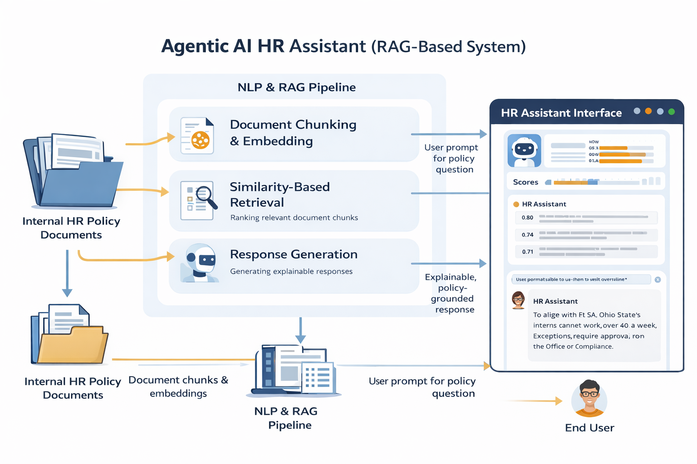

# Agentic AI HR Assistant (RAG-Based System)

## Overview
This project implements an agentic AI HR assistant that answers HR-related questions using retrieval-augmented generation (RAG). The system retrieves relevant policy sections from internal documents and generates grounded, explainable responses suitable for compliance-sensitive environments.

## System Architecture
The diagram below illustrates the end-to-end architecture of the agentic HR assistant, including document ingestion, retrieval-augmented generation (RAG), and the user-facing interface.


## Key Contributions
- Retrieval-augmented question answering over policy documents
- Similarity-based evidence grounding for explainability
- Human-centered decision support design

## Repository Structure
- `notebooks/` – Core implementation and experiments
- `report/` – Technical report and written analysis
- `figures/` – Visualizations and figures used in reporting

## Methods
- Document chunking and vector indexing
- Embedding-based similarity retrieval
- Prompt-grounded response generation

## Skills Demonstrated
- Applied NLP
- Data analysis & evaluation
- Explainable AI
- Research documentation


## Example Output
The system returns policy-grounded answers along with similarity scores that indicate which document sections informed the response. This supports transparency and explainability in compliance-sensitive contexts.

## How to Run
This project is implemented as a Jupyter notebook.
1. Clone the repository:
   ```bash
   git clone https://github.com/eomt33/agentic-ai-hr-assistant.git
